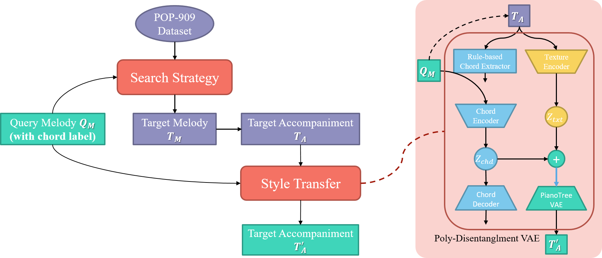

# Accompaniment Generation via Music Representation Learning

## 1. Introduction to the Work

Arrangement generation for lead melodies is an interesting topic in computer music. While conventional methods rely on sequential models, we propose a novel framework based on rule-based search strategies and style transfer in the disentangled latent space. This project is a joint application of EC2-VAE, Poly-Disentanglement-VAE, and POP-909 Dataset, three ISMIR works from Music X Lab, NYU Shanghai. Till now, we have accomplished two major features:

1) Accompaniment generation for full phrase;
2) Accompaniment generation for full score given phrase segment labels.

The backbone of these features is realized by a VAE framework which disentangles a piece of polyphonic music into chord and texture. For full-score generation, we introduce dynamic programming to optimize texture coherence within the whole song. For future work, we will engage more on representation learning techniques to achieve more controllable generation.

A high-level presentation of our work is shown in the figure below:

 

## 2. Code and File Arrangement

In this work, the codes and files are arranged as follow:

1) **assembly_full_phrase.py** achieves full-phrase accompaniment generation. To run this code, a piece of single-phrase lead melody and a reference library of accompaniment pieces are required. The default library of this work derives from the POP-909 dataset. More details about this feature is introduced on <https://zhaojw1998.github.io/project-auto_arrangement>. Demos can also be found there.
2) **assembly_full_score.py** is a new feature where dynamic programming is introduced to accomplish full-score arrangement. Demos are stored in **/full-score_demo**. It contains four demos each with different phrase configuration within the full score. The original melodies are from

## 3. Dependencies

1) **Numpy**;
2) **Pytorch 1.5** or higher;
3) **PrettyMIDI**;
4) **Pandas**.

## 4. Major References

1) Yang, Ruihan, et al. "Deep music analogy via latent representation disentanglement." arXiv preprint arXiv:1906.03626 (2019). <https://github.com/buggyyang/Deep-Music-Analogy-Demos>

2) Wang, Ziyu, et al. "Learning interpretable representation for controllable polyphonic music generation." arXiv preprint arXiv:2008.07122 (2020). <https://github.com/ZZWaang/polyphonic-chord-texture-disentanglement>

3) Wang, Ziyu, et al. "Pop909: A pop-song dataset for music arrangement generation." arXiv preprint arXiv:2008.07142 (2020). <https://github.com/music-x-lab/POP909-Dataset>

4) Dai, Shuqi, Huan Zhang, and Roger B. Dannenberg. "Automatic Analysis and Influence of Hierarchical Structure on Melody, Rhythm and Harmony in Popular Music." arXiv preprint arXiv:2010.07518 (2020). <https://github.com/Dsqvival/hierarchical-structure-analysis>.

Zhao Jingwei: jz4807@nyu.edu

2021.01.10